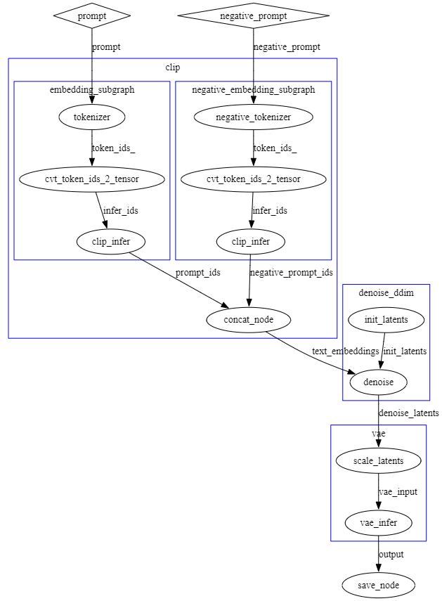
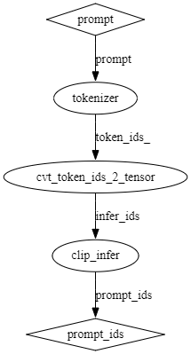

# nndeploy插件开发手册

## 插件开发简介

在nndeploy框架中，插件（plugin）是一种可以组合调用的功能模块，通常表现为继承自`dag::Node`的自定义节点。插件通过DAG进行组织和调用，用于执行开发者自定义的前/后处理逻辑、推理、初始化操作等等。

插件设计的目的是：

- 模块化：将特定的逻辑封装为节点，易于组合和替换；
- 解耦性：将插件节点与调度模块进行解耦；
- 可扩展性：开发者可以轻松接入新的调度算法和数据处理流程；

### 什么是DAG

nndeploy的执行核心是有向无环图（DAG），图由以下两个基本组件组成：

- 节点（node）:代表基本的计算或功能单元，可以是推理、调度、初始化等等；
- 边（edge）:节点之间的连接通道，用于传递张量等数据对象；

图在运行时根据节点输入输出边判断节点的执行顺序，自动调度各个节点执行。

### 插件节点在流水线中的位置

以stable diffusion 1.5为例，推理流程大致如下：



其中：

- tokenizer表示嵌入节点；
- cvt_token_ids_2_tensor表示数据转换节点；
- clip_infer表示clip模型的推理节点；
- concat_node表示数据concat节点；
- init_latents表示数据初始化节点；
- denoise表示stable-diffusion模型运行过程中的去噪节点；
- vae_infer表示vae decoder的执行节点；
- save_node表示数据存储为图片的节点；
- prompt、token_ids、prompt_ids等表示用于传递数据的边；

通过这些插件节点的组合，我们可以构建一个完整的文生图执行流程。

## 插件编写基础

nndeploy中的插件本质上是自定义的DAG节点，继承自`dag::Node`，要实现一个插件节点，一般需要完成以下步骤：

### 1. 定义节点类
```C++
class MyCustomNode : public dag::Node {
 public:
  MyCustomNode(const std::string &name,
               std::vector<dag::Edge *> inputs,
               std::vector<dag::Edge *> outputs)
      : dag::Node(name, inputs, outputs) {}

  virtual ~MyCustomNode() {}

  base::Status run() override {
    // 插件逻辑写在这里
    return base::kStatusCodeOk;
  }
};
```
### 2. 注册节点类型

为了将节点注册到框架中，需要使用注册宏：

```C++
REGISTER_NODE("nndeploy::example::MyCustomNode", MyCustomNode);
```

### 3. 节点中的输入输出访问

可以通过以下方式获取输入边中的张量：

```C++
device::Tensor *input_tensor = (device::Tensor *)(this->getInput(0)->getTensor(this));
```

在节点的输出边中创建输出张量（输出张量的内存需要在节点中分配，输入张量的内存由上一个节点分配）：

```C++
device::Tensor *output_tensor = this->getOutput(0)->create(device, tensor_desc);
```

### 4. 设置参数（可选）

你可以为插件定义参数类（继承 base::Param），并通过 setParam() 接口设置：

```C++
class MyParam : public base::Param {
 public:
  int some_value;
  PARAM_COPY(MyParam);
  PARAM_COPY_TO(MyParam);
};

auto param = std::make_shared<MyParam>();
param->some_value = 123;
my_node->setParam(param.get());
```

在节点内部可通过 param_ 成员访问：

```C++
MyParam *p = (MyParam *)(param_.get());
```

### 5. 将插件添加到计算图中

在nndeploy中，有两种方式将插件节点添加到图中：

**方式一：直接创建节点对象**

```C++
dag::Graph *graph = new dag::Graph("my_graph", {input_edge}, {output_edge});
MyCustomNode *node = (MyCustomNode *)graph->createNode<MyCustomNode>(
    "my_node", {input_edge}, {output_edge});
```

**方式二：通过NodeDesc创建**

```C++
dag::NodeDesc desc("nndeploy::example::MyCustomNode", "my_node",
                   {input_edge->getName()}, {output_edge->getName()});
MyCustomNode *node = (MyCustomNode *)graph->createNode(desc);
```

`"nndeploy::example::MyCustomNode"`为node的key，序列化时使用。

## 高级用法

### 创建子图

当插件涉及更复杂的功能逻辑时，例如模型推理、多输入合并策略等，开发者可以通过创建子图（继承 dag::Graph）来组织多个节点为一个整体流程模块：

- 子图类继承自`dag::Graph`；
- 为子图添加自定义构图函数，如`make()`，封装边与节点创建流程；
- 添加自定义参数接口，开发者可以为`Node`提供自定义参数，并在子图类中提供对应的接口；

#### 构图函数

以stable-diffusion-1.5模型的embedding过程为例，需要经历三个部分，首先对提示词进行tokenize，再将分词向量转换成适合clip模型执行的tensor格式，最后将向量输入到clip模型中，进行文本到图像语义空间的转换。在sd的例子中，这三个部分被封装成了三个`Node`，同时封装成了一个`Embedding`子图。子图的构图函数如下：

```C++
  base::Status make(base::InferenceType inference_type) {
    prompt_ = this->getInput(0);
    if (prompt_ == nullptr) {
      NNDEPLOY_LOGE("prompt is nullptr\n");
      return base::kStatusCodeErrorInvalidParam;
    }
    token_ids_ = this->createEdge("token_ids_");
    tokenizer_node_ = (tokenizer::TokenizerEncodeCpp *)this
                          ->createNode<tokenizer::TokenizerEncodeCpp>(
                              "tokenizer", {prompt_}, {token_ids_});

    infer_ids_ = this->createEdge("infer_ids");
    cvt_node_ =
        (CvtTokenIds2TensorNode *)this->createNode<CvtTokenIds2TensorNode>(
            "cvt_token_ids_2_tensor", {token_ids_}, {infer_ids_});

    embedding_ = this->getOutput(0);
    if (embedding_ == nullptr) {
      NNDEPLOY_LOGE("embedding is nullptr\n");
      return base::kStatusCodeErrorInvalidParam;
    }
    clip_infer_node_ = (infer::Infer *)this->createInfer<infer::Infer>(
        "clip_infer", inference_type, {infer_ids_}, {embedding_});
    return base::kStatusCodeOk;
  }
```

实现完自定义子图后，开发者可以通过如下的方法将子图添加到更大的图中：

```C++
EmbeddingGraph *embedding_graph =
      (EmbeddingGraph *)(graph->createNode<EmbeddingGraph>(
          "embedding_subgraph", {prompt}, {prompt_ids}));
embedding_graph->make(inference_type);
```

子图会经过框架的调用，自动实现流水线并行。

#### 自定义参数

在`tokenizer`和`infer`过程中，执行时需要传入一些参数，例如分词器的类型、模型文件的路径等等，这些参数可以通过在自定义子图中添加接口进行传入：

```C++
base::Status setTokenizerParam(tokenizer::TokenizerPraram *param) {
  tokenizer_node_->setParam(param);
  return base::kStatusCodeOk;
}

base::Status setInferParam(inference::InferenceParam *param) {
  clip_infer_node_->setParam(param);
  return base::kStatusCodeOk;
}
```

然后在构建完子图后传入：

```C++
embedding_graph->make(inference_type);

tokenizer::TokenizerPraram *tokenizer_param =
    new tokenizer::TokenizerPraram();
tokenizer_param->tokenizer_type_ = tokenizer::TokenizerType::kTokenizerTypeHF;
tokenizer_param->is_path_ = true;
tokenizer_param->json_blob_ = text2image_param->model_value_[0];
embedding_graph->setTokenizerParam(tokenizer_param);

inference::InferenceParam *infer_param = new inference::InferenceParam();
infer_param->device_type_ = text2image_param->device_type_;
infer_param->model_type_ = text2image_param->model_type_;
infer_param->is_path_ = text2image_param->is_path_;
std::vector<std::string> onnx_path = {text2image_param->model_value_[1]};
infer_param->model_value_ = onnx_path;
embedding_graph->setInferParam(infer_param);
```

#### 打印子图

子图继承自`dag::Node`，同样可以调用`dump()`接口进行图结构的打印：

```C++
embedding_graph->dump();
```

使用[graphviz](https://dreampuf.github.io/GraphvizOnline)进行可视化之后，结果图如下：



### 复合节点

在有些情况下，开发者希望向某个`Node`中添加一些自定义的操作，例如，在`infer`节点之前添加一些格式转换的操作，但是不希望开发`Node`，此时可以通过创建复合节点来实现所需的功能：